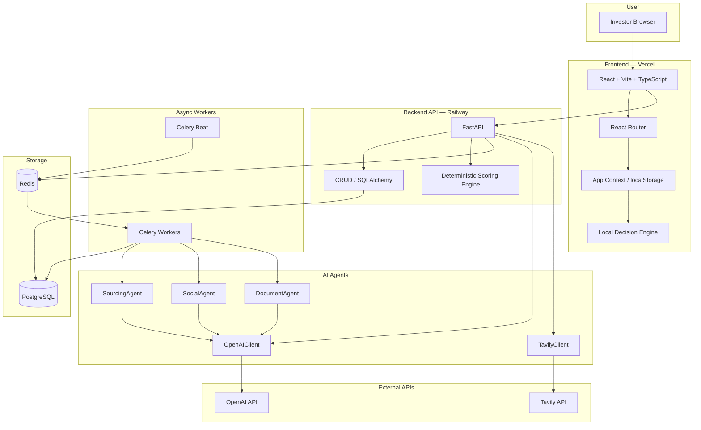

# FounderOS Architecture Guide

> Use this document to generate a flow chart / architecture diagram for a demo video. It describes the full system so another AI can render it as a visual diagram (e.g., Mermaid, Lucidchart, Figma, Canva, or a video storyboard tool).

---

## 1. What the system does (elevator pitch)

FounderOS is an evidence-first founder intelligence platform for early-stage investors. It turns raw signals—pitch decks, LinkedIn/GitHub footprints, web searches, and structured simulations—into a versioned, explainable Founder Score (0–100) plus an opportunity screen across three independent axes: Founder, Market, and Idea-vs-Market. It does **not** make a black-box prediction; it surfaces evidence, confidence, coverage, contradictions, and the next best diligence action.

---

## 2. High-level architecture

The system is split into two deployable units and three supporting layers:

```
┌─────────────────────────────────────────────────────────────────────────────┐
│                              FOUNDEROS                                       │
├─────────────────────────────────────────────────────────────────────────────┤
│  Layer 1: Frontend (React + Vite + TypeScript + Tailwind)                     │
│  ├─ Investor workspace: 7 pages/routes                                      │
│  ├─ Local decision engine & lightweight agents                              │
│  └─ Talks to FastAPI backend via REST                                       │
├─────────────────────────────────────────────────────────────────────────────┤
│  Layer 2: Backend (FastAPI + Pydantic + SQLAlchemy)                         │
│  ├─ REST API endpoints                                                      │
│  ├─ Deterministic scoring engine                                            │
│  ├─ CRUD & persistence logic                                                │
│  └─ Celery task orchestration                                               │
├─────────────────────────────────────────────────────────────────────────────┤
│  Layer 3: AI/Research agents                                                │
│  ├─ SourcingAgent → discovers founders from the web                         │
│  ├─ SocialAgent → researches LinkedIn/GitHub footprint                      │
│  ├─ DocumentAgent → extracts claims & evidence from decks/docs                │
│  ├─ OpenAIClient / TavilyClient → web search + LLM reasoning                │
│  └─ API lock + circuit breaker → serialize & protect LLM calls                │
├─────────────────────────────────────────────────────────────────────────────┤
│  Layer 4: Data & storage                                                    │
│  ├─ PostgreSQL (structured records: founders, evidence, scores, claims)      │
│  ├─ Redis (Celery broker + result backend + distributed locks)                │
│  └─ Files are NOT stored; only extracted text/claims/evidence are kept        │
├─────────────────────────────────────────────────────────────────────────────┤
│  Layer 5: Deployment                                                        │
│  ├─ Frontend → Vercel                                                       │
│  ├─ Backend API → Railway                                                   │
│  ├─ PostgreSQL + Redis → Railway services                                   │
│  └─ Celery beat + workers → background services on Railway                  │
└─────────────────────────────────────────────────────────────────────────────┘
```

---

## 3. Component breakdown

### 3.1 Frontend (`frontend/`)

| Area | Files | Role in the demo |
|------|-------|------------------|
| **Router / App shell** | `src/App.tsx` | Left rail navigation: Discovery, Sourcing, Apply, Cases, Decisions, Thesis, Validation. Header shows current page. |
| **Pages** | `src/pages/*.tsx` | Each page maps to a stage of the investor workflow. |
| **API client** | `src/api/client.ts` | Thin `fetch` wrapper calling `/v1/*` endpoints. |
| **State** | `src/store/appContext.tsx` | React Context storing user role, case overrides, demo decisions; persisted to `localStorage`. |
| **Local decision engine** | `src/engine/routing.ts`<br>`src/engine/trust.ts`<br>`src/engine/scoring.ts` | Determines case status (`SCREENING`, `DILIGENCE`, `ASSOCIATE_REVIEW`, etc.) from driver scores and claims. |
| **Lightweight agents** | `src/agents/*.ts` | Deterministic rule-based specialist agents that read a case and produce analyst outputs (Founder, Market, Product, Traction, Differentiation, Terms, Validator, Skeptic, Deal Captain, Memo Writer). |
| **Types/contracts** | `src/domain/types.ts`<br>`src/agents/contracts.ts` | Shared domain model: `InvestmentCase`, `Claim`, `DriverAssessment`, `CaseStatus`, `CaseMemo`. |

### 3.2 Backend (`backend/`)

| Area | Files | Role |
|------|-------|------|
| **API surface** | `main.py` | FastAPI routes: founders, theses, opportunities, sourcing schedules/jobs, deck uploads, social research, seed data. |
| **Pydantic models** | `models.py` | Request/response schemas: `Founder`, `EvidenceItem`, `ScoreSnapshot`, `OpportunityScreen`, `Claim`, `SourcingJob`, etc. |
| **DB models** | `db_models.py` | SQLAlchemy ORM tables mapping to PostgreSQL. |
| **Persistence** | `database.py`, `crud.py` | Connection management and all DB reads/writes. |
| **Scoring engine** | `scoring.py` | Deterministic founder score calculation from `EvidenceItem`s. No LLM involved. |
| **Seed data** | `seed_data.py` | Demo theses, founders, schedules, pool items, opportunities. |

### 3.3 AI/Research agents (`backend/research/`)

| Agent | File | Input | Output |
|-------|------|-------|--------|
| **SourcingAgent** | `sourcing_agent.py` | Investment thesis (sectors, stages, geographies, risk appetite) | List of recommended founders (`FounderPoolItem`) |
| **SocialAgent** | `social_agent.py` | Founder name + LinkedIn/GitHub URLs | Summary, footprints, evidence items |
| **DocumentAgent** | `document_agent.py` | Extracted text from deck/doc | Profile, claims, evidence items |
| **OpenAIClient** | `openai_client.py` | Generic research query | Structured profile + evidence |
| **TavilyClient** | `tavily_client.py` | Search query | Real-time web search results |
| **Extractor** | `extractor.py` | Raw LLM JSON | Typed Pydantic objects (`Founder`, `EvidenceItem`, `SocialMediaBackground`) |

### 3.4 Async task workers (`backend/tasks/`)

| Task | File | Triggered by | Work done |
|------|------|--------------|-----------|
| `research_social_background` | `social_research.py` | Founder creation / manual re-run | Runs `SocialAgent`, stores background, optionally recalculates score. |
| `refresh_pool_task` / `run_sourcing_job` | `founder_pool.py` | Manual refresh or Celery beat schedule | Runs `SourcingAgent`, deduplicates, persists pool items. |
| `extract_document` | `document_extraction.py` | Deck upload endpoint | Extracts text, runs `DocumentAgent`, saves claims & evidence, recalculates score. |
| Celery app | `celery_app.py` | Redis broker/result backend | Beat dispatcher checks sourcing schedules every 60s and queues jobs. |

---

## 4. Key entities & data model

Use these as boxes/cards in the diagram:

| Entity | What it stores | Key fields |
|--------|----------------|------------|
| **Founder** | Identity + profile | `id`, `name`, `email`, `company`, `role`, `location`, `linkedin_url`, `github_url`, `latest_score_snapshot_id` |
| **EvidenceItem** | One observed signal | `dimension`, `evidence_type`, `rubric_level` (0–4), `source_trust`, `task_relevance`, `recency_factor`, `independence_group`, `polarity` |
| **ScoreSnapshot** | A point-in-time founder score | `founder_score`, `evidence_band_low/high`, `overall_confidence`, `evidence_coverage`, `trend`, `dimension_breakdowns` |
| **Opportunity** | Three-axis investment view | `founder_score`, `founder_market_fit`, `team_completeness`, `market_posture`, `idea_vs_market_posture` |
| **Claim** | A diligence claim | `claim`, `source`, `trust_status`, `confidence`, `contradiction`, `next_action` |
| **FounderPoolItem** | AI-sourced candidate | `name`, `company`, `source`, `reason`, `status` (`recommended` / `approved` / `dismissed`) |
| **SourcingSchedule** | Recurring sourcing config | `thesis_id`, `interval_seconds`, `sources` |
| **SourcingJob** | One sourcing run | `status`, `progress`, `leads_found`, `leads_added`, `started_at`, `completed_at` |

---

## 5. Deterministic scoring engine (no LLM)

Highlight this as a separate "box" in the flow chart; it is the core differentiator.

1. **Group** all `EvidenceItem`s by `Dimension` (Execution, Learning, Customer Selling, Judgment, Leadership, Ownership, Claim Reliability).
2. **Effective weight** per item = `EVIDENCE_TYPE_STRENGTH × source_trust × task_relevance × recency_factor`.
3. **Cap** any single item at 30% of a dimension’s total effective weight.
4. **Raw score** = weighted average of `rubric_level / 4 × 100`.
5. **Confidence** = coverage × source-diversity factor × contradiction factor, then clamped by hard rules:
   - Chat-only evidence cannot exceed 0.60.
   - Above 0.65 requires a non-chat artifact.
   - Above 0.80 requires ≥3 independent source groups.
6. **Adjusted score** = shrink raw score toward neutral prior (50) by `(1 − confidence)`.
7. **Evidence band** = `±20 × (1 − confidence)` around adjusted score.
8. **Founder Score** = weighted average of dimension adjusted scores.
9. **Trend** = difference vs. previous `ScoreSnapshot`.

---

## 6. User flows to animate in the demo

Pick 2–3 of these flows for the video. Each bullet is a step that should become a node or animation frame.

### Flow A: Cold-start founder → structured assessment → updated score

1. Investor clicks **Seed hackathon demo**.
2. Backend creates a founder with cold-start snapshot: **Score 50, Confidence 0%, all dimensions Unknown**.
3. Investor clicks **Invite assessment**.
4. Founder completes structured simulations:
   - Sales and objection handling
   - Prioritization under constraints
   - Belief updating
   - Scaling and leadership
5. Responses are sent to `POST /v1/founders/{id}/simulate-assessment`.
6. Backend converts responses into `EvidenceItem`s.
7. `calculate_founder_score()` recomputes score, confidence, coverage, evidence band, trend.
8. New `ScoreSnapshot` is stored; `latest_score_snapshot_id` updated on founder.
9. Investor views updated Founder Score + evidence ledger + dimension breakdown.

### Flow B: AI sourcing → pool approval → social research → opportunity screen

1. Investor sets a thesis (sectors, stages, geographies).
2. Investor clicks **Refresh pool**.
3. `POST /v1/founders/pool/refresh` queues a Celery task.
4. `SourcingAgent` uses OpenAI + Tavily web search to discover founders.
5. New `FounderPoolItem`s are saved as `recommended`.
6. Investor approves a recommendation.
7. Backend:
   - Creates a `Founder` record.
   - Creates initial cold-start `ScoreSnapshot`.
   - Creates an `Opportunity`.
   - Queues `research_social_background` Celery task.
8. `SocialAgent` researches LinkedIn/GitHub, returns summary + evidence.
9. Backend recalculates score and updates the opportunity.
10. Investor opens the opportunity screen to see three independent axes.

### Flow C: Deck upload → claim extraction → diligence workspace

1. Investor opens a case/opportunity.
2. Investor uploads a deck (PDF/DOCX/TXT/MD).
3. `POST /v1/opportunities/{id}/deck` accepts the file.
4. Backend base64-encodes the bytes and queues `extract_document`.
5. Worker extracts plain text, runs `DocumentAgent`.
6. Agent returns `profile`, `summary`, `claims`, `evidence`.
7. Worker saves `Claim`s and `EvidenceItem`s, then recomputes founder score.
8. Investor sees extracted claims with `TrustStatus` and any contradictions.
9. Investor reviews the diligence workspace / memo.

### Flow D: Recurring sourcing schedule (background automation)

1. Investor creates a `SourcingSchedule` attached to a thesis.
2. Celery beat checks every minute for due schedules.
3. When due, it creates a `SourcingJob` and queues `run_sourcing_job`.
4. Worker runs `SourcingAgent`, deduplicates against pool/existing founders.
5. Worker updates `SourcingJob` status/progress and saves new pool items.
6. Investor views `GET /v1/sourcing/jobs` history.

---

## 7. How to draw the flow chart

### 7.1 Suggested diagram types

Create **two diagrams**:

1. **System Architecture Diagram** — static boxes & arrows showing layers and tech.
2. **End-to-End User Flow Diagram** — swim-lane or sequence-style showing what happens when an investor interacts with the product.

### 7.2 System architecture diagram (boxes to include)

Group components into colored clusters:

| Cluster | Color suggestion | Boxes inside |
|---------|------------------|--------------|
| **User** | Light gray | Investor (browser), Founder (browser) |
| **Frontend** | Blue | React Router, Pages, API Client, App Context, Local Engine, Agent Stubs |
| **Backend API** | Green | FastAPI endpoints, Pydantic models, CRUD, Auth/CORS middleware |
| **Scoring Engine** | Orange | `calculate_founder_score()`, Dimension breakdown, Confidence rules |
| **AI Agents** | Purple | SourcingAgent, SocialAgent, DocumentAgent, OpenAIClient, TavilyClient |
| **Async Workers** | Yellow | Celery Beat, Celery Workers, Redis locks |
| **Storage** | Dark gray | PostgreSQL, Redis |
| **External APIs** | Red | OpenAI API, Tavily API |
| **Deployment** | Teal | Vercel, Railway (web + worker + DB + Redis) |

**Connections to draw:**

- Investor browser → Frontend (HTTPS)
- Frontend → Backend API (`/v1/*`) via `fetch`
- Backend API → PostgreSQL (read/write)
- Backend API → Redis (Celery enqueue + locks)
- Backend API → OpenAIClient / TavilyClient
- OpenAIClient / TavilyClient → External APIs (HTTP)
- Celery Workers → PostgreSQL (update jobs/scores)
- Celery Workers → Redis (broker/backend + locks)
- Celery Beat → Redis (dispatch schedules)

### 7.3 End-to-end user flow diagram (swim-lane style)

Use 4 swim-lanes:

1. **Investor UI**
2. **Frontend logic**
3. **Backend API**
4. **AI / Async workers / Storage**

Example node sequence for Flow B (AI sourcing):

```
Investor UI:     [Set thesis] → [Click Refresh pool] → [View recommended list] → [Approve candidate] → [Open opportunity]
Frontend logic:         ↓                ↓ (POST /v1/founders/pool/refresh)              ↓ (POST approve)                ↓
Backend API:            →        [Queue refresh task]    →    [Create Founder + Opportunity]  → [Return opportunity id]
AI/Workers/Storage:     →        [Celery Worker runs SourcingAgent] → [Save pool items to PostgreSQL]
```

For Flow C (deck upload), add an async worker branch that extracts text and runs `DocumentAgent`.

### 7.4 Visual conventions

- **Use rounded rectangles** for user-facing actions.
- **Use cylinders** for databases (PostgreSQL, Redis).
- **Use gears/cogs** for background workers.
- **Use document icons** for decks and claim extraction.
- **Use numbered circles** to show the order of operations.
- **Dashed arrows** = async / background / optional.
- **Solid arrows** = synchronous request/response.
- **Color-code by layer** (use the cluster colors above).
- **Add mini data labels** on arrows, e.g., `EvidenceItem[]`, `ScoreSnapshot`, `Claim[]`.

### 7.5 Key callouts / annotations to add

Place text callouts near the relevant boxes:

- **"Files are never stored"** — near the deck upload/document worker path.
- **"Score engine is deterministic — no LLM"** — inside the orange scoring engine box.
- **"Confidence hard caps: chat-only ≤0.60, artifact needed for >0.65, 3+ sources for >0.80"** — near scoring engine.
- **"Three independent opportunity axes"** — near the opportunity screen.
- **"Pedigree-blind: no university, employer, geography, gender, age, accent, network prestige"** — near founder profile/scoring.

### 7.6 Demo-video-friendly framing

If the diagram is meant to be animated in a demo video, structure it as **4 scenes**:

1. **Scene 1 — Ingestion:** Show all the ways evidence gets in (deck upload, social research, structured assessment, manual evidence).
2. **Scene 2 — The Engine:** Zoom into the deterministic scoring engine; show evidence items entering and a Founder Score emerging.
3. **Scene 3 — The Opportunity Screen:** Show the three axes (Founder, Market, Idea-vs-Market) staying independent.
4. **Scene 4 — Decision Support:** Show claims with trust status, contradictions, next action, and routing to `ASSOCIATE_REVIEW` / `DILIGENCE` / etc.

---

## 8. Tech stack summary

| Layer | Stack | Deploy target |
|-------|-------|---------------|
| Frontend | React 18, Vite, TypeScript, Tailwind CSS, React Router, Lucide icons, Vitest | Vercel |
| Backend | Python 3.13, FastAPI, Pydantic v2, SQLAlchemy 2, Alembic, Uvicorn | Railway |
| Background jobs | Celery + Redis + custom retry/circuit-breaker | Railway worker services |
| AI models | OpenAI `gpt-5` via `OPENAI_*` env vars; Tavily for web search | External APIs |
| Database | PostgreSQL 15+ with JSONB columns | Railway PostgreSQL |
| Cache / broker | Redis 7+ | Railway Redis |

---

## 9. Files a diagram-generating AI should read for detail

If you need more precision, read these files in order:

1. `README.md` — product philosophy, hackathon demo flow, evaluation posture.
2. `backend/main.py` — full REST API surface.
3. `backend/models.py` — Pydantic schemas (especially `EvidenceItem`, `ScoreSnapshot`, `OpportunityScreen`).
4. `backend/scoring.py` — deterministic scoring rules.
5. `backend/research/*.py` — AI agent internals.
6. `backend/tasks/*.py` — async worker internals.
7. `frontend/src/App.tsx` — navigation and pages.
8. `frontend/src/api/client.ts` — API calls from the frontend.
9. `frontend/src/domain/types.ts` — frontend domain model.
10. `frontend/src/engine/routing.ts` — case status routing logic.

---

## 10. Quick Mermaid starter (optional)

If the target AI supports Mermaid, here is a starter architecture diagram you can render directly:



---

## 11. What the demo video should emphasize

If this architecture is being turned into a demo video, highlight these messages:

- FounderOS is a **measurement system**, not a personality test or hype score.
- The **Founder Score is versioned and evidence-backed** — every score has a ledger.
- **Confidence and coverage are shown alongside the score**, never hidden.
- **Contradictions lower confidence before they lower score**.
- The system is **blind to pedigree proxies** (school, employer, geography, demographics).
- The **score engine is deterministic Python**, not an LLM guess.
- The **three opportunity axes are independent** so a strong founder in a weak market is still visible.
- AI is used for **evidence extraction and discovery**, not for the final numeric score.
